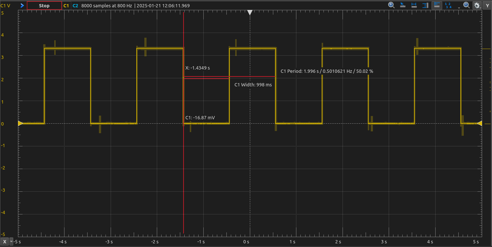
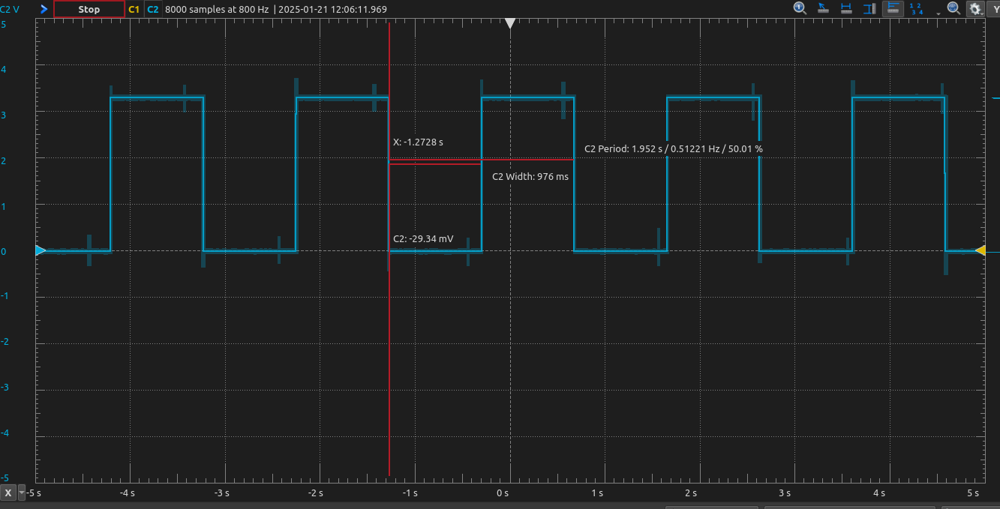

# Project 1: Heartbeat LEDs
For this project, we were to create a 1s heartbeat LED (1s on 1s off) using two different methods:
* Delay
* Interrupt
Overall, this project served as a refresher for what we have previously learned.

To accomplish this, we first created a flowchart

## Delay loop method
For the delay loop method, I used a nested loop, having an inner and outer loop. All this is doing is implemeting a delay while our main loop turns the LED on and off.

To get the timing exact, I divided up the bits of the clock (1 MHz). For the inner loop, I chose 333. For the outer loop, I chose 1000. This is because each iteration of the inner loop takes 3 cycles, so 333 * 3000 = 999000. This was very close, but not quite, so I updated the inner loop to be 350, which gave me a near perfect timing.

### Screenshot of timing

## Interrupt
For the interrupt method, I used the SMCLK (1 MHz) and an up counter. With the clock frequency, I found that I needed to have a 4*8 clock divider to accomplish the correct timing. I'll be completely honest. I figured this out due to trial and error. I started with an 8 clock divider but found it was too fast, so I added the 4 clock divider as well. After I did that, I found where in the book described how to calculate these, which I'll be using forward.

### Screenshot of timing
